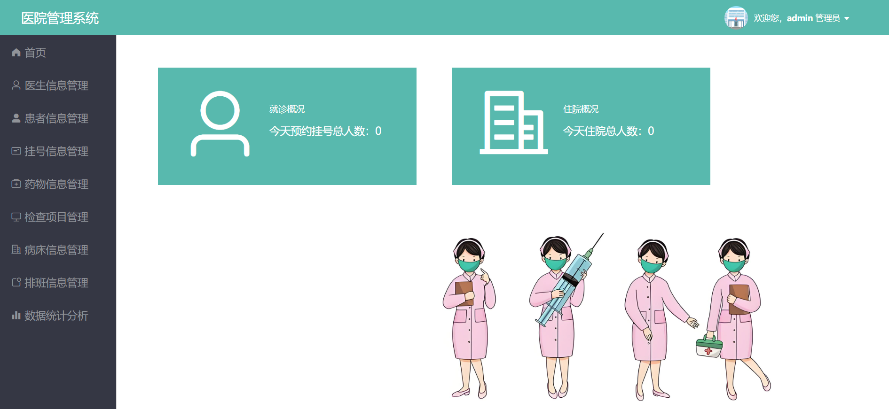
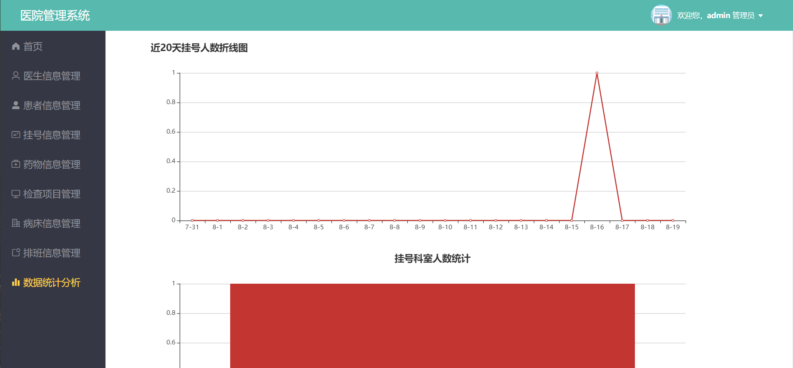
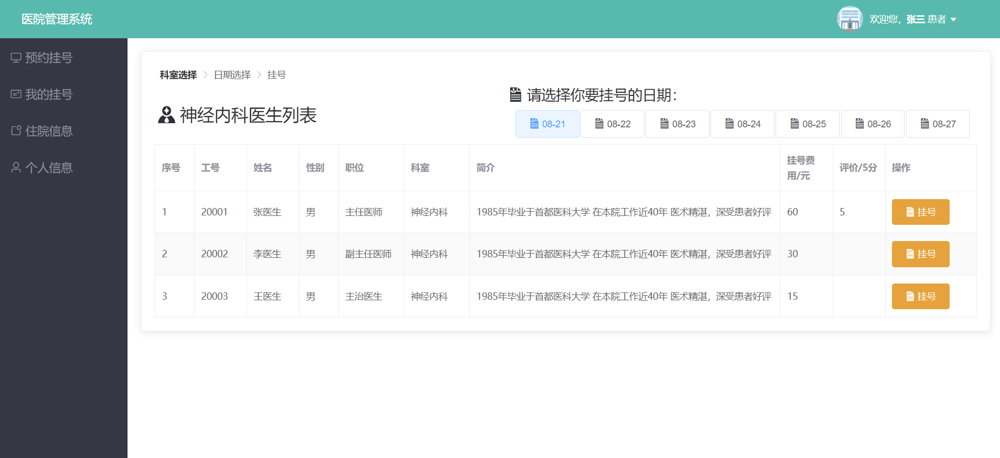
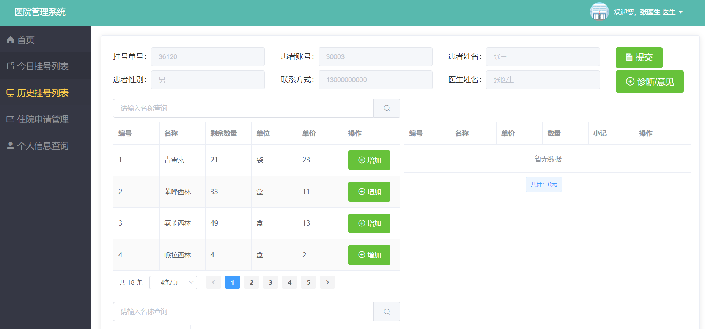
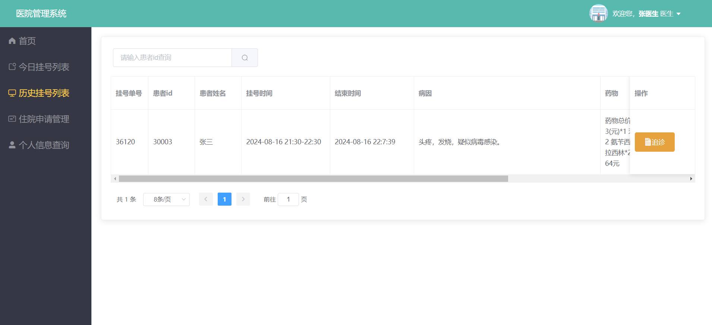
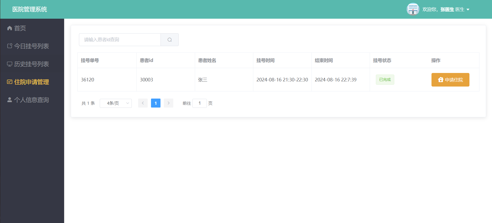
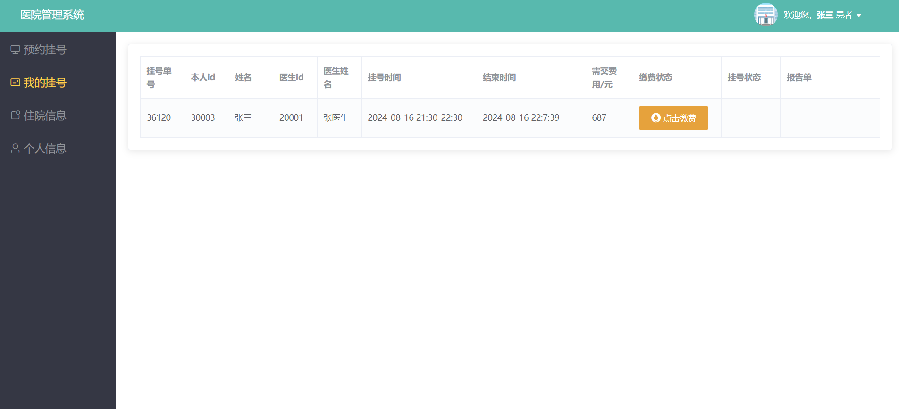
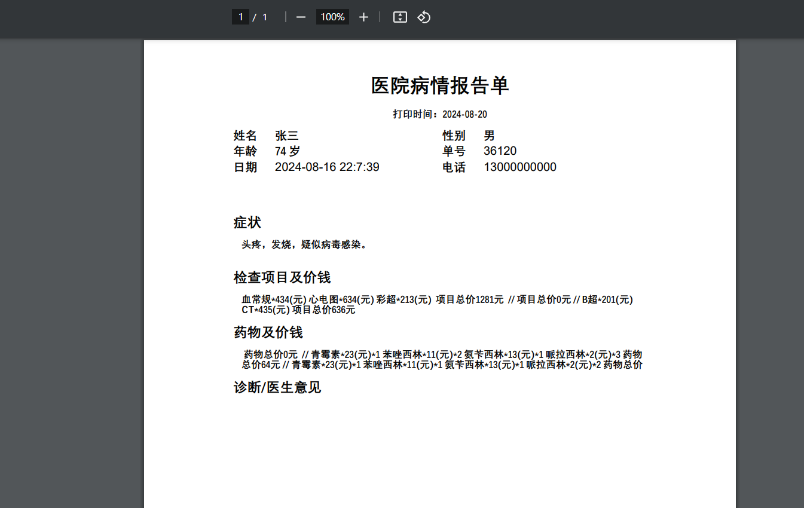

# 基于SpringBoot+Vue的医院挂号管理系统 

（源代码+12000字文档+ppt）

## 项目简介

基于springboot+vue实现的医院挂号管理系统，有管理员、医生和患者三种角色，功能非常完善。 
管理员可以对医生和患者以及挂号信息进行管理，还可以对医生开的药物、检查项目、病床进行管理，还可以给各个科室的医生进行排班操作。 
医生可以对挂号的患者进行诊断，填写病历单以及开一些检查项目和药物，还可以给重病患者申请住院，对于有复诊需求的患者也可以进行追诊操作。 
患者可以通过系统选择医生进行挂号操作，医生针对完成后可以查看医生的诊断单，并且可以进行缴费操作，还可以看到自己的历史病历信息等。 
本系统前端使用vue+elementui，后端使用springboot框架。数据库使用的是mysql数据库。 
该系统功能完善，界面美观，非常适合作为毕设或者课程作业以及新手开发学习。 

## 视频介绍
<a href="https://www.bilibili.com/video/BV159e3eKETb/?spm_id_from=333.999.0.0" target="_blank">点击查看B站视频介绍</a>

## 功能介绍
 

## 技术服务

## 系统图片
#### 1.登录页面
 
#### 2.管理端首页
 
#### 3.排班信息管理
 
#### 4.数据统计分析
 
#### 5.预约挂号
 
#### 6.医生诊断患者
 
#### 7.追诊患者
 
#### 8.住院申请
 
#### 9.用户缴费
 
#### 10.诊断单据打印
 